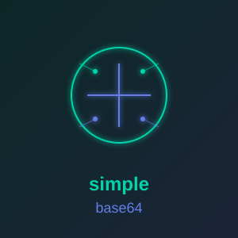

<p align="center">
  
</p>

<h1 align="center">simple_ocr_capture</h1>

<p align="center">
  <a href="https://simple-eiffel.github.io/simple_ocr_capture/">Documentation</a> •
  <a href="https://github.com/simple-eiffel/simple_ocr_capture">GitHub</a> •
  <a href="https://github.com/simple-eiffel/simple_ocr_capture/releases">Download</a>
</p>

<p align="center">
  
  
  
  
</p>

**Read a book through your screen.** Capture a region, run it through a local OCR
model, and append the text to a single file — page after page, unattended if you
want. Part of the [Simple Eiffel](https://github.com/simple-eiffel) ecosystem.

## Status

✅ **Production** — v1.11.0

- Ships as one executable plus cairo.dll — no runtime, no Python, **no Vision2**: the GUI is [simple_widgets](https://github.com/simple-eiffel/simple_widgets) over [simple_shell](https://github.com/simple-eiffel/simple_shell), the platform library this application's own C originally seeded
- Talks to a local Ollama server over WinHTTP; nothing leaves the machine
- Unattended auto-advance: capture the page, turn it, capture the next
- Full Design by Contract coverage, void-safe, SCOOP-capable

> **This is an application, not a library.** It is a Windows GUI program you
> install and run. It is in the ecosystem because it is written in Eiffel and
> built on the `simple_*` libraries, not because you would add it to an ECF.

---

## Overview

Set the capture region once, then hit the hotkey after each page turn. The text
accumulates in one file in the order you captured it.

Given an advance button to click and a page indicator to read, it will do the
turning itself and read a whole book unattended, stopping on its own when the
page stops changing.

Everything runs locally. The default model is olmOCR-2 (about 9.5 GB), pulled on
first run; a discrete GPU with 12 GB or more of VRAM is strongly recommended.

---

## Features

### Capture

- **Drag to set the region** — no coordinate typing; Esc or right-click cancels
- **System-wide hotkey** — Ctrl+Alt+G by default, works while the reader has focus
- **Region outlines** — all three rectangles drawn on the desktop, each with its
  own colour and dash pattern, and taken out of frame automatically at the shutter
- **PNG or BMP** output, named after the reader's own page indicator
  (`ocr_Page_90-92_of_139.png`) rather than a counter that means nothing later

### Unattended runs

- **Auto-advance** — clicks the page-turn button and keeps going
- **Stops rather than guesses** — a page that will not turn ends the run and says why
- **Duplicate suppression** — text identical to the block just written is not appended
- **Focus-preserving clicks** — the pointer and foreground window are put back as found

### Video

- **A whole channel in one go** — give the Video tab a channel (`@handle`, a
  `/channel/UC...` link, a legacy `/c/` or `/user/` link, or just the name) and
  press **Harvest Channel**. Every video the channel lists under **Videos** is
  collected, then fetched in batches of five, into a folder named after the
  channel. Measured against `@BibleLine`: 539 videos listed in 18 pages in 5.6
  seconds. No browser, no API key, no yt-dlp — YouTube's own browse endpoint
  over WinHTTP. Shorts are not included; the Videos tab does not list them
- **Categories from your own machine** — the local model reads the harvested
  titles, names the categories that fit *that* channel, and files every video
  under one of them. Nothing is sent anywhere, and there is nothing to
  configure: the first text model your Ollama holds is used. A title it will
  not confidently place goes to `Uncategorized` rather than being guessed at
- **Harvested transcripts carry YAML front matter** — title, channel, category,
  URL, video id, date and tags — and stay flat in one folder per channel, with
  an index grouping them by category. Re-run the same channel later and only
  the new videos are fetched: each folder keeps a manifest of the video ids
  already written, matched on the id, not the title
- **YouTube captions to transcript** — or paste one link or a whole list; each
  is looked up as it lands (title, channel, length, caption track), then Fetch
  All writes every ready video to its own Markdown file in one folder, about a
  second each: no playback, no OCR, no browser, no Python. Pure Eiffel over
  WinHTTP, the events streamed through simple_json
- **Members-only videos** — turn on the Engine-tab toggle or press "Fetch via My
  Browser Session"; a WebView2 window carries your own YouTube login, you sign in
  once, and the gated caption tracks are fetched from your session. No cookie file
  is read; only YouTube's own requests leave the machine
- `--captions <url> <out.txt>` fetches one video headless;
  `--channel <channel> [<root>] [--no-categories]` runs a whole channel the same way

### Output and diagnostics

- **The output prompt** — every unattended run (auto-advance, a video fetch) first
  shows the output folder, file name, resulting path and what will happen to the
  file, and starts only from that sheet's verb

- **One transcript file**, appended to, with optional per-capture header lines
- **Progress strip** — scan rate, page rate and ETA once a run has two captures behind it
- **Findings grid** — problems the run noticed itself, with the remedy
- **Run log** — every page's starting rectangles and decisions, because a box
  aimed wrong is the usual failure and coordinates are unreconstructable later
- **No silent folder creation** — a mistyped output path asks before it becomes a directory
- **Clear or archive the images** — delete a finished book's screenshots, or move
  them to a like-named folder on a roomier drive, matching `ocr_*.png` and
  `ocr_*.bmp` only and never overwriting anything already at the destination

---

## Install

Download the latest installer from
[Releases](https://github.com/simple-eiffel/simple_ocr_capture/releases) and run it.

It is a per-user install: no UAC prompt, and the application only ever writes to
`%APPDATA%` and the output folder you choose.

**Requirements**

| | |
|---|---|
| Windows | 10 or 11, 64-bit |
| [Ollama](https://ollama.com/download) | installed only — the application starts and supervises it |
| An OCR model | the application offers to download it on first run |

### First run

1. Launch it. You do **not** need to start Ollama yourself.
2. If the model is missing it offers to download it — the window stays usable meanwhile.
3. **Set Region by Dragging...** and drag over the area you want transcribed.
4. Set the output folder.
5. **Test Capture** to confirm the region is right.
6. **Check Setup / Install Model** for a full report on the whole chain.

The complete manual ships with the installer and lives at
[`installer/README.txt`](installer/README.txt).

---

## Building from source

Requires EiffelStudio 25.02 and, for the installer, Inno Setup 6.

```bash
git clone https://github.com/simple-eiffel/simple_ocr_capture.git
cd simple_ocr_capture

export SIMPLE_EIFFEL=/d/prod    # where the simple_* libraries live

./build.sh -c     # type-check only
./build.sh        # finalize the GUI application
./build.sh -t     # finalize and run the test suite
./build.sh -i     # finalize, then build the installer
```

Binaries land in `EIFGENs/<target>/F_code/`.

### Targets

| Target | What it is |
|---|---|
| `ocr_capture` | The shipped GUI application |
| `ocr_cli` | Headless `--worker` (spawned per capture), `--shot` (pipeline check), `--captions` (video transcript) |
| `hotkey_spike` | Throwaway proof that the system-wide hotkey fires |
| `simple_ocr_capture_tests` | Console test runner (87 tests) |

### Dependencies

`base`, `time`, `vision2`, plus `simple_json`, `simple_base64` and `simple_process`.

Deliberately **not** `simple_http`: it resolves `libcurl.dll` at runtime from a
path that is not on `PATH`, so a finalized binary fails with a bare "cURL issue".
`OCR_HTTP` uses WinHTTP instead — present on every Windows, nothing to redistribute.

---

## Known limitations

- The model **normalises visually ambiguous characters**. A lowercase `l` inside a
  serial number can come back as `1`, and prompting does not prevent it — it is
  inherent to a language model reading rather than a character classifier. Do not
  trust the output for checksums, licence keys or base64 without checking. Prose,
  footnotes and tables are where it is strong.
- Captures are sequential; triggering during a cycle is ignored rather than queued.
- Auto-advance clicks a fixed screen point. Move the reader window mid-run and the
  page will fail to turn — which stops the run rather than clicking blindly on, but
  the advance box needs re-dragging.
- The window is tuned for a 150% display and may look oversized at 100%. It is
  resizable; the chosen size is not yet remembered.
- Video captions come from YouTube's caption track only. A video with no CC
  button has nothing to fetch; the screen-capture and audio routes in
  FEASIBILITY-video-captions.md are not built. A members-only video needs the
  browser-session route above — without it the player will not hand its track
  to an anonymous request.
- A channel harvest reads the **Videos** tab. A channel that puts its content
  in playlists or streams rather than there will list fewer videos than you
  expect, and Shorts are never included.
- The category pass needs a text model in Ollama. Without one the harvest says
  so and fetches everything under `Uncategorized` rather than stopping — the
  transcripts are the point, the filing is a convenience.

---

## License

MIT — see [LICENSE](LICENSE).
